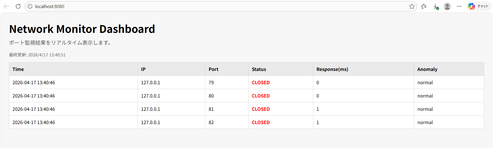

# Network Monitor (C言語)

## 概要

C言語で実装したネットワーク監視ツールです。  
指定したIPアドレスとポート範囲に対してTCP接続を行い、ポートの状態を定期的に監視します。

単発のポートスキャンにとどまらず、状態変化や応答遅延、連続失敗といった異常を検知し、  
サービスの障害や性能劣化をリアルタイムに把握できる点が特徴です。

また、マルチスレッドによる高速スキャン、CSVログによる履歴管理に加え、  
簡易HTTPサーバとJSON APIを実装することで、監視結果をブラウザ上でリアルタイムに可視化できます。

---

## 想定利用シーン

- サーバ運用時のポート監視
- 開発環境でのサービス疎通確認
- ネットワーク障害の早期検知
- セキュリティチェック（不要ポートの検出）

---

## 開発背景

本システムは、ネットワーク監視の重要性を背景に、
ポート状態の変化や異常をリアルタイムに把握することを目的として開発しました。

一般的なポートスキャンツールは単発の状態確認に留まることが多く、
継続的な監視や状態変化の検知、可視化には対応していないケースがあります。
そのため、状態の変化や異常を即座に把握することが難しいという課題がありました。

そこで本システムでは、定期的なポート監視に加え、
状態変化・応答遅延・連続失敗といった異常を検知し、
さらにWebブラウザ上でリアルタイムに可視化できる仕組みを実装しました。

また、C言語によるネットワークプログラミングおよびマルチスレッド処理の理解を深めるため、
低レイヤから実装する実践的な開発として取り組みました。

---

## デモ（画面）

ブラウザ上でポート監視結果をリアルタイム表示



---

## 主な機能

- 設定ファイルによる監視条件の外部管理  
  → 監視対象IP、ポート範囲、監視間隔、Webサーバポートをコード外で設定可能

- ポートスキャン（TCP connect）  
  → ポートの開閉状態を確実に判定

- マルチスレッドによる並列処理  
  → スキャン時間を大幅に短縮

- 応答時間の計測  
  → サービスの遅延や性能劣化を検知

- CSVファイルへのログ保存  
  → 時系列データとして後から分析可能

- 異常検知機能
  - 状態変化（OPEN⇄CLOSED）
  - 応答遅延
  - 連続失敗  
  → 単なる状態確認ではなく「異常の検知」を実現

- 簡易HTTPサーバの実装（C言語）  
  → socket APIのみを用いてHTTP通信を実装し、監視結果を外部から取得可能にした

- JSON API提供  
  → 監視結果をHTTP経由で取得可能

- ブラウザでリアルタイム監視表示  
  → 視覚的に状態を把握可能

---

## 技術構成

- 言語: C
- OS: Linux / WSL
- 使用技術:
  - 設定ファイル解析（config）
  - pthread（マルチスレッド）
  - mutex (排他制御)
  - socket API（TCP通信）
  - 簡易HTTPサーバ実装
  - JSON生成（外部ライブラリを使用せず手動で構築）

---
## 技術選定の理由

本システムでは、各機能に対して以下の理由で技術を選定しました。

### 設定ファイル（config）
監視対象やポート範囲、監視間隔などの設定をコードから分離し、
保守性および運用性を向上させるために設定ファイル方式を採用しました。

これにより、再ビルドを行わずに監視条件を変更できる構成としています。

### TCP（connect）によるポートスキャン
ポートの開閉状態を確実に判定するため、TCPのconnectを使用しました。  
SYNスキャンと比較して検知されやすいものの、実装がシンプルであり、
確実な接続確認が可能であるため、本システムではフルコネクト方式を採用しています。

### pthread（マルチスレッド）
複数ポートを順番にスキャンすると時間がかかるため、ポートごとにスレッドを生成し並列処理を行いました。  
これにより、スキャン時間の大幅な短縮を実現しています。

### mutex（排他制御）
複数スレッドから共有データ（監視結果）へ同時アクセスが発生するため、
データ競合を防ぐ目的でmutexによる排他制御を導入しました。  
これにより、安全にデータを共有できる設計としています。

### socket API
低レイヤの通信処理を理解するため、外部ライブラリを使用せずsocket APIを直接利用しました。  
接続処理やエラー処理を自ら実装することで、ネットワークの動作をより深く理解しています。

### 簡易HTTPサーバ
監視結果を外部から取得可能にするため、HTTPサーバを実装しました。  
これにより、CLIツールにとどまらず、ブラウザからの可視化を可能にしています。

### JSON生成（手動実装）
外部ライブラリを使用せず、snprintfを用いてJSON文字列を手動で生成しています。  
これにより、データ構造とフォーマットの理解を深めるとともに、
処理の流れを明確に把握できるようにしました。

### CSVログ保存
監視結果を時系列で記録するため、CSV形式でログを保存しています。  
後から状態変化や異常の傾向を分析できるようにすることを目的としています。

本システムでは「確実性」「リアルタイム性」「可視化」の3点を重視して設計しました。

---

## システム構成

```
[ポート監視スレッド]
        ↓
[ScanResult]
        ↓
[異常検知]
        ↓
[SharedStatus (mutex)]
        ↓
 ┌───────────────┐
 │ CSV保存       │
 │ Webサーバ     │
 └───────────────┘
        ↓
[ブラウザ表示]
```

---

## ディレクトリ構成

```text
network-monitor/
├── src/
│   ├── main.c
│   ├── scanner.c
│   ├── anomaly.c
│   ├── status.c
│   ├── webserver.c
│   ├── logger.c
│   ├── config.c
│   └── utils.c
├── include/
│   ├── scanner.h
│   ├── anomaly.h
│   ├── status.h
│   ├── webserver.h
│   ├── logger.h
│   ├── config.h
│   └── utils.h
├── web/
│   ├── index.html
│   └── screenshot.png
├── data/
│   └── results.csv
└── Makefile

```

---

## 設定ファイル

監視条件は `data/config.txt` に記述します。

例:

```txt
ip=127.0.0.1
start_port=79
end_port=82
interval=5
web_port=8080
```

各項目の説明:

- ip : 監視対象のIPアドレス
- start_port / end_port : 監視するポート範囲
- interval : 監視間隔（秒）
- web_port : Webサーバのポート番号

---

## 実行方法

### ビルド

```bash
make
```

### 実行

```bash
./monitor
```
本プログラムは、data/config.txt に記述された設定に基づいて動作します。

### Web画面

ブラウザで以下にアクセス

http://localhost:8080/ (configで変更可能)

---

## 実行結果例

```text
[2026-04-16 12:00:01] 127.0.0.1:80 OPEN (10ms)
[2026-04-16 12:00:01] 127.0.0.1:81 CLOSED
[ANOMALY] Port 80 response delay detected (200ms)
```

---

## 工夫した点

- マルチスレッド化
    - ポートごとにスレッドを立てることでスキャンを並列化し、処理時間を大幅に短縮した

- 状態共有の設計
    - SharedStatus + mutex によりスレッド間で安全にデータ共有を実現し、競合状態を防止した

- 異常検知機能
  - 状態変化（OPEN⇄CLOSED）を検知し、サービス停止や復旧を即座に把握
  - 応答時間のしきい値超過により、性能劣化を検知
  - 連続失敗回数を管理し、一時的な通信エラーと継続的障害を区別

- C言語でHTTPサーバを実装
    - 外部ライブラリを使わず、socketのみでHTTP通信を実装し、内部動作を理解できるようにした

- リアルタイム可視化
    - JSON APIを自作し、JavaScriptで定期取得することでリアルタイム表示を実現した

---

## 今後の改善

本システムは基本的な監視機能を実装しているが、より実用的なツールとするために以下の改善を検討しています。

- 異常の種類ごとの色分け強化  
  異常内容を視覚的に区別できるようにし、直感的な監視を可能にする

- グラフ表示（応答時間の可視化）  
  時系列データとして応答時間を表示し、性能劣化の傾向を把握できるようにする

- アラート通知（ログ・メール等）  
  異常発生時に通知を行い、即時対応を可能にする

- ログ出力のスレッドセーフ化  
  複数スレッドからの同時書き込みによる競合を防ぐため、排他制御を導入する

- JSON生成の安全性向上  
  文字列のエスケープ処理を追加し、不正なJSON生成を防ぐ

- タイムアウト制御の最適化  
  接続待ち時間の調整により、誤検知と処理速度のバランスを改善する

- Webサーバのマルチスレッド化
  複数クライアントからの同時アクセスに対応するため、並列処理を導入する

---

## 学んだこと

本開発を通して、以下の知識および実装スキルを習得しました。

- マルチスレッドプログラミングの設計  
  ポートごとにスレッドを分割し、並列処理による高速化を実現した

- 排他制御（mutex）の重要性  
  共有データへの同時アクセスによる競合状態を防ぐため、mutexを用いた制御を実装した

- ネットワークプログラミング（socket）  
  TCPのconnectを用いたポート開閉判定や、サーバソケットの構築を理解した

- HTTPプロトコルの基本  
  リクエストの解析およびレスポンス生成を自作することで、HTTP通信の構造を理解した

- JSONデータの構造と生成  
  外部ライブラリを用いずにJSONを手動生成し、データフォーマットの理解を深めた

- フロントエンドとの連携  
  JavaScriptによるAPI取得と表示を実装し、バックエンドとの連携を経験した
---

## 作者

高山 逸希

ネットワークおよびセキュリティ分野に興味があり、
低レイヤからシステムを理解することを目的として本プロジェクトを開発しました。